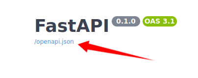

# Fastapi-For-Dify-Tools

## Install

```shell
git clone https://github.com/StudentTYH/Fastapi-For-Dify-Tools
cd ./Demo/xxx
pip install -r requirements.txt

#填入host 和 port 信息   .env   如http://localhost:8767
```


```
python run.py
```

## Usage
1、访问：http://localhost:8767/docs

2、复制openapi.json到dify tools中

3、导入 DSL (yml)文件到dify中使用自定义组件




## Tools

[百度搜索](https://github.com/StudentTYH/Fastapi-For-Dify-Tools/tree/main/Demo/baidu_search)

[PaddleOCR](https://github.com/StudentTYH/Fastapi-For-Dify-Tools/tree/main/Demo/paddle_ocr)
